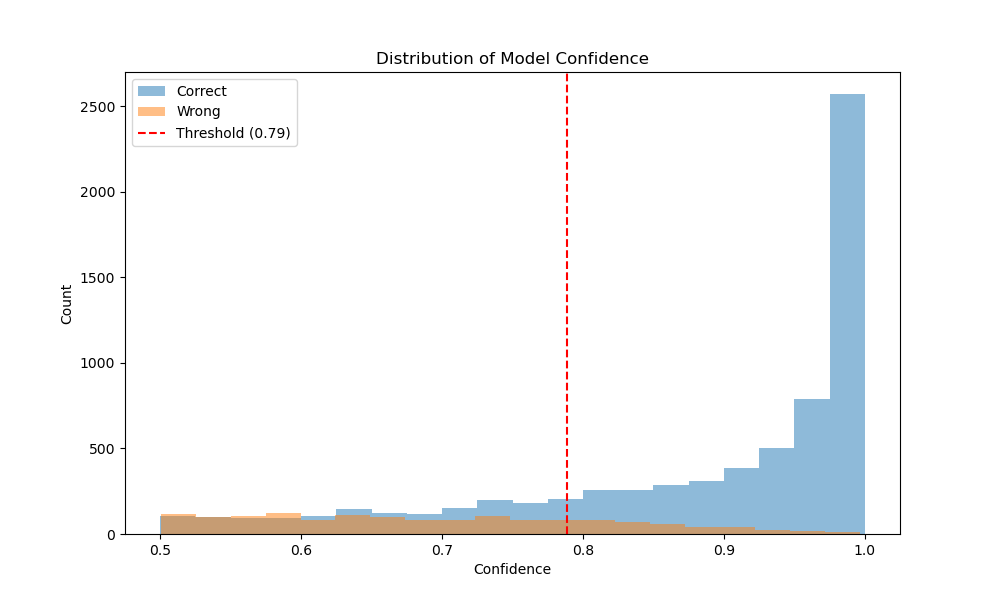
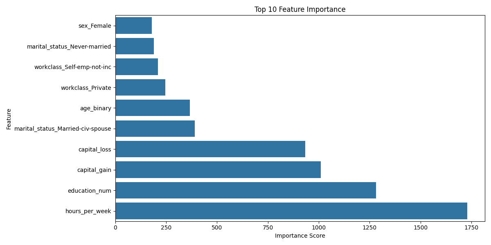
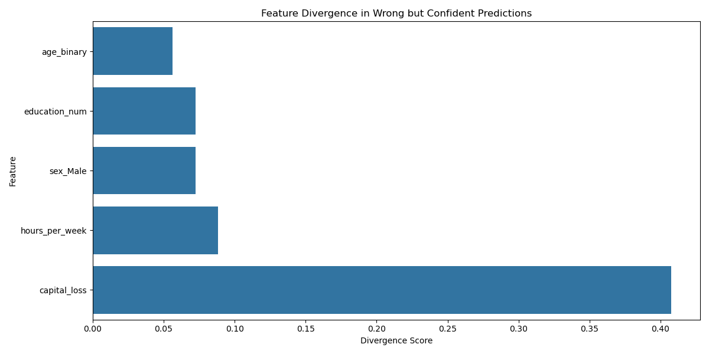

# Adult Income Classification Pipeline

This repository contains the implementation of the first and second part of the Adult Income Classification project, which focuses on building a fair and privite classification pipeline for predicting income levels.

## Project Structure

```
.
├── adult.csv           # Dataset file
├── classifier.py       # Main implementation file
└── README.md          # This file
```

## Part 1: Basic Classification Implementation
### Features
1. **Data Loading and Preprocessing**
   - Load Adult dataset with appropriate data types
   - Handle missing values
   - Remove unnecessary features (fnlwgt)
   - Standardize column names

2. **Feature Processing**
   - Age binarization (as required by project)
   - Numerical feature standardization
   - Categorical feature encoding using one-hot encoding
   
3. **Data Splitting**
   - Train/Validation/Test split (60%/20%/20%)
   - Stratified sampling to maintain class distribution

4. **Model Training**
   - LightGBM classifier implementation
   - Early stopping with validation set
   - Basic hyperparameter configuration

5. **Model Evaluation**
   - Multiple evaluation metrics (Accuracy, Precision, Recall, F1-score)
   - Classification report for detailed performance analysis
   - Feature importance visualization

## Part 2: Fairness Analysis
### Features
1. **Original Model Fairness Analyses**
   - Verifies two fairness metrics based on the test dataset and the predicted label
   - Report findings of the two metrics

2. **Fairness Technique to Ensure Fair Classifier**
   - Adversarial Debiasing (make the model less reliant on sensitive features)
   - Main Network (Predictor): A standard model (e.g., logistic regression, neural network)
   - Adversarial Network: A separate network is introduced to predict the sensitive feature (sex and age)

3. **New Model Evaluation**
   - Multiple evaluation metrics (Accuracy, Precision, Recall, F1-score)
   - Classification report for detailed performance analysis

4. **New Model Fairness Analyses**
   - Verifies two fairness metrics based on the test dataset and the new predicted label
   - Report findings of the two metrics
     
## Part 3: Privacy Analysis
### Features
1. **Assessing the Current State of Sensitive Attributes**
   - Extract the preprocessed data on attributes Age and Sex
   - Compute the cross-tabulation

2. **Applying Local Differential Privacy Technique**
   - Apply local differential privacy using randomised response
   - Select the most appropriate values for truth probabilities
   - Create a private dataset

3. **Dataset Comparison**
   - Compute cross-tabulation for private dataset
   - Calculate the absolute and relative errors in comparison with the original dataset

4. **New Model Evaluation**
   - Split the private dataset as in Part 1
   - Train and evaluate the same model with private data
   - Report findings   

## Part 5: Explainability
### Features
1. **Confidence Assessment**
   - analyze_predictions method for confidence scoring
   - Wrong but confident prediction identification and filtering

2. **Privacy Impact Analysis**
   - analyze_privacy_impact method for tracking attribute changes
   - Focus on sensitive attributes (Age and Sex)
   - Focus on wrong but confident predictions

3. **Visualization Suite**
   - plot_confidence_distribution for confidence analysis
   - plot_feature_importance for feature ranking
   - plot_feature_divergence for error pattern analysis

## Usage
```python
# Run the classification pipeline
python classifier.py
```

## Current Results and Limitations
## Part 1: Basic Classification Implementation
### Performance Metrics
- Accuracy: ~0.83
- Significant disparity between classes:
  - Class 0 (≤50K): Precision: 0.95, Recall: 0.82
  - Class 1 (>50K): Precision: 0.61, Recall: 0.86

### Identified Issues
1. **Class Imbalance**
   - Imbalanced class distribution affecting model performance
   - Higher performance on majority class (≤50K)
   - Lower precision for minority class (>50K)

2. **Protected Attributes**
   - Potential bias in predictions regarding age and gender
   - Need for fairness analysis in subsequent parts

3. **Privacy Concerns**
   - Sensitive attributes (age, gender) require privacy protection
   - Current implementation doesn't address privacy requirements

## Part 2: Fair Classification Implementation
### Performance Metrics
- Accuracy: ~0.82
- Significant disparity between classes:
  - Class 0 (≤50K): Precision: 0.84, Recall: 0.94
  - Class 1 (>50K): 0.71, Recall: 0.47

### Fairness Metrics
   - Disparate Impact -> Measures the relative rate of positive outcomes between privileged and unprivileged groups. A value close to 1 indicates fairness
      - Before Adversarial Debiasing: 0.35, indicating significant bias against the unprivileged group
      - After Adversarial Debiasing: 0.99, demonstrating a much more balanced outcome and improved fairness
   - Statistical Parity Difference -> Measures the absolute difference in probabilities of receiving a positive outcome between privileged and unprivileged groups. A value close to 0 indicates fairness
      - Before Adversarial Debiasing: -0.40, suggesting a strong imbalance in outcomes between the groups
      - After Adversarial Debiasing: -0.001, showing a minimal disparity and a significantly fairer model.

### Identified Issues
1. **Class Imbalance**
   - Strong performance on Class 0, but poor recall for Class 1 (>50K)
   - New model fails to predict the minority class effectively


## Part 3: Privacy Classification Implementation
### Performance Metrics
- Accuracy: ~0.82
- Significant disparity between classes holds:
  - Class 0 (≤50K): Precision: 0.95, Recall: 0.81
  - Class 1 (>50K): 0.59, Recall: 0.87

### Local Differential Privacy Metrics
   - In both randomised response techniques for Age and Sex, 0.90 probability of preserving the truth was introduced, i.e. p=q=0.90 (with epsilon ~2).
   - This value was chosen based on the analysis of relative errors for each attribute (not exceeding 10%) and the proximity of absolute values in cross-tabulation. We preserve the informational value of the data, at the same time guaranteeing pretty high privacy with the value of epsilon being around 2.

### Model Performance
- As a result, the accuracy was not much affected (0.82 compared to 0.83 in the original classifier).
- Although, it should be noted that even with the introduction of lower probabilities p and q, similar results were obtained, i.e. low impact on model performance. This could be explained by age and sex attributes being not of that high importance as features.

## Part 5: Explainability
### Model Confidence Analysis
- Total prediction errors: 1,528 instances
- High confidence errors: 382 instances (25% of total errors)
  - These are cases where the model was wrong but highly confident in its predictions



*Figure 1: Distribution of model confidence for correct and wrong predictions. The red dashed line indicates the threshold for high confidence.*

### Privacy Impact Analysis
The analysis of wrong but highly confident predictions reveals:
- Age attribute was changed in 11.78% of cases
- Sex attribute was changed in 9.16% of cases

### Feature Importance Analysis
#### Top Feature Importance


*Figure 2: Top 10 most important features in the model's decision making.*

#### Most Divergent Features


*Figure 3: Features showing the highest divergence in wrong but confident predictions.*

### Key Findings
1. **Privacy Impact**: 
   - The similar rates between privacy noise (10%) and attribute changes in wrong predictions (11.78% for Age, 9.16% for Sex) suggest that privacy protection is not a significant factor in model errors
   - This indicates that the model's mistakes are not primarily due to the privacy-preserving modifications

2. **Feature Importance**: 
   - Work-related features (hours_per_week) and education level are the most influential globally
   - Education level shows the highest divergence in wrong predictions, suggesting it might be a key factor in model mistakes

3. **Recommendations**:
   - Focus on improving the model's handling of education-related features, as they show both high importance and high divergence in error cases
   - The privacy mechanism appears to be working as intended, with minimal impact on model decisions


## Dependencies
- Python 3.x
- pandas
- numpy
- scikit-learn
- LightGBM
- matplotlib
- aif360

## Installation
```bash
pip install pandas numpy scikit-learn lightgbm matplotlib aif360
```

## Notes
- Current implementation focuses on basic classification pipeline and fair analysis
- Subsequent parts will address fairness, privacy, and explainability
- Model performance serves as baseline for future improvements

## Citation
Adult Income dataset from UCI Machine Learning Repository:
https://archive.ics.uci.edu/ml/datasets/adult
