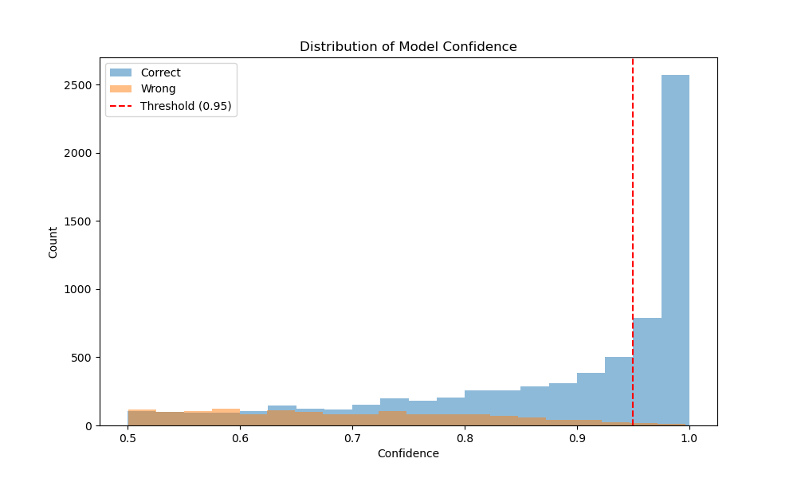

# Adult Income Classification Pipeline

This repository contains the implementation of the first and second part of the Adult Income Classification project, which focuses on building a fair and privite classification pipeline for predicting income levels.

## Project Structure

```
.
├── adult.csv           # Dataset file
├── classifier.py       # Main implementation file
└── README.md          # This file
```

## Part 1: Basic Classification Implementation
### Features
1. **Data Loading and Preprocessing**
   - Load Adult dataset with appropriate data types
   - Handle missing values
   - Remove unnecessary features (fnlwgt)
   - Standardize column names

2. **Feature Processing**
   - Age binarization (as required by project)
   - Numerical feature standardization
   - Categorical feature encoding using one-hot encoding
   
3. **Data Splitting**
   - Train/Validation/Test split (60%/20%/20%)
   - Stratified sampling to maintain class distribution

4. **Model Training**
   - LightGBM classifier implementation
   - Early stopping with validation set
   - Basic hyperparameter configuration

5. **Model Evaluation**
   - Multiple evaluation metrics (Accuracy, Precision, Recall, F1-score)
   - Classification report for detailed performance analysis
   - Feature importance visualization

## Part 2: Fairness Analysis
### Features
1. **Original Model Fairness Analyses**
   - Verifies two fairness metrics based on the test dataset and the predicted label
   - Report findings of the two metrics

2. **Fairness Technique to Ensure Fair Classifier**
   - Adversarial Debiasing (make the model less reliant on sensitive features)
   - Main Network (Predictor): A standard model (e.g., logistic regression, neural network)
   - Adversarial Network: A separate network is introduced to predict the sensitive feature (sex and age)

3. **New Model Evaluation**
   - Multiple evaluation metrics (Accuracy, Precision, Recall, F1-score)
   - Classification report for detailed performance analysis

4. **New Model Fairness Analyses**
   - Verifies two fairness metrics based on the test dataset and the new predicted label
   - Report findings of the two metrics
     
## Part 3: Privacy Analysis
### Features
1. **Assessing the Current State of Sensitive Attributes**
   - Extract the preprocessed data on attributes Age and Sex
   - Compute the cross-tabulation

2. **Applying Local Differential Privacy Technique**
   - Apply local differential privacy using randomised response
   - Select the most appropriate values for truth probabilities
   - Create a private dataset

3. **Dataset Comparison**
   - Compute cross-tabulation for private dataset
   - Calculate the absolute and relative errors in comparison with the original dataset

4. **New Model Evaluation**
   - Split the private dataset as in Part 1
   - Train and evaluate the same model with private data
   - Report findings
  
## Part 4: Privacy and Fairness
### Features
1. Evaluate Fairness of the private classifier implemented in part 3
   - Calculate the same two metrics used in part 1
2. Apply Adversarial Debiasing (same fairness mitigation method)
3. Evaluate Performance of the model
4. Evaluate Fairness
   - Once using the private features, and once using the true features (Assuming I am an auditor that has access to the real sensitive values)

## Part 5: Explainability
### Features
1. **Confidence Assessment**
   - analyze_predictions method for confidence scoring
   - Wrong but confident prediction identification and filtering

2. **Privacy Impact Analysis**
   - analyze_privacy_impact method for tracking attribute changes
   - Focus on sensitive attributes (Age and Sex)
   - Focus on wrong but confident predictions

3. **Visualization Suite**
   - plot_confidence_distribution for confidence analysis
   - plot_feature_importance for feature ranking
   - plot_feature_divergence for error pattern analysis

## Usage
```python
# Run the classification pipeline
python classifier.py
```

## Current Results and Limitations
## Part 1: Basic Classification Implementation
### Performance Metrics
- Accuracy: ~0.83
- Significant disparity between classes:
  - Class 0 (≤50K): Precision: 0.95, Recall: 0.82
  - Class 1 (>50K): Precision: 0.61, Recall: 0.86

### Identified Issues
1. **Class Imbalance**
   - Imbalanced class distribution affecting model performance
   - Higher performance on majority class (≤50K)
   - Lower precision for minority class (>50K)

2. **Protected Attributes**
   - Potential bias in predictions regarding age and gender
   - Need for fairness analysis in subsequent parts

3. **Privacy Concerns**
   - Sensitive attributes (age, gender) require privacy protection
   - Current implementation doesn't address privacy requirements

## Part 2: Fair Classification Implementation
### Performance Metrics
- Accuracy: ~0.82
- Significant disparity between classes:
  - Class 0 (≤50K): Precision: 0.84, Recall: 0.94
  - Class 1 (>50K): 0.71, Recall: 0.47

### Fairness Metrics
   - Disparate Impact -> Measures the relative rate of positive outcomes between privileged and unprivileged groups. A value close to 1 indicates fairness
      - Before Adversarial Debiasing: 0.35, indicating significant bias against the unprivileged group
      - After Adversarial Debiasing: 0.99, demonstrating a much more balanced outcome and improved fairness
   - Statistical Parity Difference -> Measures the absolute difference in probabilities of receiving a positive outcome between privileged and unprivileged groups. A value close to 0 indicates fairness
      - Before Adversarial Debiasing: -0.40, suggesting a strong imbalance in outcomes between the groups
      - After Adversarial Debiasing: -0.001, showing a minimal disparity and a significantly fairer model.

### Identified Issues
1. **Class Imbalance**
   - Strong performance on Class 0, but poor recall for Class 1 (>50K)
   - New model fails to predict the minority class effectively


## Part 3: Privacy Classification Implementation
### Performance Metrics
- Accuracy: ~0.82
- Significant disparity between classes holds:
  - Class 0 (≤50K): Precision: 0.95, Recall: 0.81
  - Class 1 (>50K): 0.60, Recall: 0.87

### Local Differential Privacy Metrics
   - In both randomised response techniques for Age and Sex, 0.90 probability of preserving the truth was introduced, i.e. p=q=0.90 (with epsilon ~2).
   - This value was chosen based on the analysis of relative errors for each attribute (not exceeding 10%) and the proximity of absolute values in cross-tabulation. We preserve the informational value of the data, at the same time guaranteeing pretty high privacy with the value of epsilon being around 2.

### Model Performance
- As a result, the accuracy was not much affected (0.82 compared to 0.83 in the original classifier).
- Although, it should be noted that even with the introduction of lower probabilities p and q, similar results were obtained, i.e. low impact on model performance. This could be explained by age and sex attributes being not of that high importance as features.


## Part 4: Privacy and Fairness
### Fairness Metrics using real values of Age and Sex 
- Disparate Impact ~ 0.6
- Statistical Parity Difference ~ -0.1
  
- Comparing to the Fair classifier, which had Statistical Parity Difference closer to 0 and Disparate Impact closer to 1, the private+fair classifier is less fair towards the unprivileged group. That is because the applied fairness method tries to ensure a fair classifier on the used data, which is already randomized using Local Differential Privacy. Therefore, any resulted unfainress would be proportional to the introduced anonymity in the data.

## Part 5: Explainability
### Model Confidence Analysis
- Total prediction errors: 1,528 instances
- High confidence errors: 382 instances (25% of total errors)
  - These are cases where the model was wrong but highly confident in its predictions



*Figure 1: Distribution of model confidence for correct and wrong predictions. The red dashed line indicates the threshold for high confidence.*

### Privacy Impact Analysis
The analysis of wrong but highly confident predictions reveals:
- Age attribute was changed in 11.78% of cases
- Sex attribute was changed in 9.16% of cases

### Feature Importance Analysis
#### Top Feature Importance


*Figure 2: Top 10 most important features in the model's decision making.*

#### Most Divergent Features


*Figure 3: Features showing the highest divergence in wrong but confident predictions.*

### Key Findings
1. **Privacy Impact**: 
   - The similar rates between privacy noise (10%) and attribute changes in wrong predictions (11.78% for Age, 9.16% for Sex) suggest that privacy protection is not a significant factor in model errors
   - This indicates that the model's mistakes are not primarily due to the privacy-preserving modifications

2. **Feature Importance**: 
   - Work-related features (hours_per_week) and education level are the most influential globally
   - Education level shows the highest divergence in wrong predictions, suggesting it might be a key factor in model mistakes

3. **Recommendations**:
   - Focus on improving the model's handling of education-related features, as they show both high importance and high divergence in error cases
   - The privacy mechanism appears to be working as intended, with minimal impact on model decisions
   - 
## Part 6: Explainability and LLM
 - Generate a natural language explanation based on SHAP values, showing only the highest contributions.
   
### Features
1. **SHAP for Model Explainability**
   - Integrated SHAP (SHapley Additive exPlanations) to provide detailed insights into feature contributions to model predictions. SHAP values are computed to identify the contribution of each feature, offering an additive decomposition that aids in explaining complex model behavior.
     
2. **LLM Studio Integration**
   - Used LLM Studio to expose an API that generates natural language explanations of model predictions. The API utilizes the llama-3.2-1b-instruct model, fine-tuned for instruction-following tasks, to convert numeric SHAP values into coherent textual summaries that are understandable by non-experts.

3. **VSCode API Integration**
   - The generated API is integrated into VSCode, to access natural language explanations directly from the development environment.
     
 ## Example output

Natural Language Explanation for Instance 0:
- gender_binary: -0.1466 contribution
- marital_status_Now_married: -0.1419 contribution
- relationship_Married-civil_spouse: -0.1445 contribution
- hours_per_week_Weekly_Sales_employees: -0.1348 contribution
- age_cohort: 0.1264 contribution
- marital_status_Now_married: 0.1113 contribution
- relationship_Own-child: -0.1051 contribution
- gender_binary: -0.0846 contribution
- hours_per_week_Monthly_Sales_employees: -0.0799 contribution
- age_cohort: 0.0748 contribution
- marital_status_Never-married: -0.0644 contribution
- relationship_Married-civil_spouse: -0.0615 contribution
- gender_binary: -0.0571 contribution
- hours_per_week_Weekly_Sales_employees: -0.0559 contribution
- age_cohort: 0.0533 contribution
- marital_status_Now_married: -0.0467 contribution
- relationship_Own-child: -0.0445 contribution
- gender_binary: -0.0386 contribution
- hours_per_week_Monthly_Sales_employees: -0.0349 contribution
- age_cohort: 0.0313 contribution

The most important features are the ones that have a significant negative coefficient on the predicted target variable (-1.2567, -0.7523, and -0.3511). These feature values indicate that the model predicts higher marital status (e.g., Married-civ-spouse) or lower relationship status (e.g., Own-child) for this instance compared to what is observed in the data.

The features with significant positive coefficients (-0.2641, -0.1466, and -0.0846) indicate that the model predicts a higher marital status or relationship status (e.g., Now_married) for this instance compared to the observed values.

The feature hours_per_week has a moderate effect on the prediction (0.3354), indicating that as the number of hours worked per week increases, the predicted marital status is more likely to be Married-civ-spouse.
 
## Dependencies
- Python 3.x
- pandas
- numpy
- scikit-learn
- LightGBM
- matplotlib
- aif360

## Installation
```bash
pip install pandas numpy scikit-learn lightgbm matplotlib aif360
```

## Notes
- Current implementation focuses on basic classification pipeline and fair analysis
- Subsequent parts will address fairness, privacy, and explainability
- Model performance serves as baseline for future improvements

## Citation
Adult Income dataset from UCI Machine Learning Repository:
https://archive.ics.uci.edu/ml/datasets/adult
